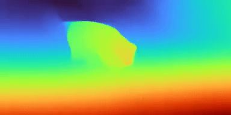
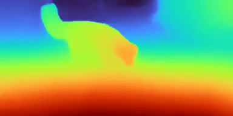
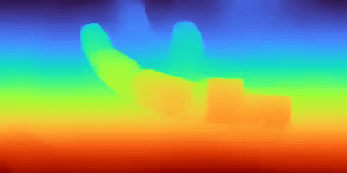

# Consistent Depth of Moving Objects in Video


This repository contains training code for the SIGGRAPH 2021 paper
"[Consistent Depth of Moving Objects in
Video](https://dynamic-video-depth.github.io/)".

This is not an officially supported Google product.

## Installing Dependencies

We provide both conda and pip installations for dependencies.

- To install with conda, run 

`
conda create --name dynamic-video-depth --file ./dependencies/conda_packages.txt
`

- To install with pip, run

`
pip install -r ./dependencies/requirements.txt
`


## Training
We provide two preprocessed video tracks from the DAVIS dataset. To download the pre-trained single-image depth prediction checkpoints, as well as the example data, run:


```
bash ./scirpts/download_data_and_depth_ckpt.sh
```

This script will automatically download and unzip the checkpoints and data. If you would like to download manually 

To train using the example data, run:

```
bash ./experiments/davis/train_sequence.sh 0 --track_id dog
```

The first argument indicates the GPU id for training, and `--track_id` indicates the name of the track. ('dog' and 'train' are provided.)

After training, the results should look like:

| Video       |  Our Depth | Single Image Depth |
:----:| :----:| :----:
 |  |  |
 |  |  |


## Dataset Preparation:

To help with generating custom datasets for training, We provide examples of preparing the dataset from DAVIS, and two sequences from ShutterStock, which are showcased in our paper.

The general work flow for preprocessing the dataset is:

1. Calibrate the scale of camera translation, transform the camera matrices into camera-to-world convention, and save as individual files.

2. Calculate flow between pairs of frames, as well as occlusion estimates.

3. Pack flow and per-frame data into training batches.

To be more specific, example codes are provided in `.scripts/preprocess`

We provide the triangulation results [here](https://drive.google.com/file/d/1U07e9xtwYbBZPpJ2vfsLaXYMWATt4XyB/view?usp=sharing) and [here](https://drive.google.com/file/d/1om58tVKujaq1Jo_ShpKc4sWVAWBoKY6U/view?usp=sharing). You can download them in a single script by running:

```
bash ./scripts/download_triangulation_files.sh
```

### Davis data preparation

1. Download the DAVIS dataset here, and unzip it under `./datafiles`. 

2. Run `python ./scripts/preprocess/davis/generate_frame_midas.py`. This requires `trimesh` to be installed (`pip install trimesh` should do the trick). This script projects the triangulated 3D points to calibrate camera translation scales.

3. Run `python ./scripts/preprocess/davis/generate_flows.py` to generate optical flows between pairs of images. This stage requires `RAFT`, which is included as a submodule in this repo.


4. Run `python ./scripts/preprocess/davis/generate_sequence_midas.py` to pack camera calibrations and images into training batches.

### ShutterStock Videos


1. Download the ShutterStock videos [here](https://www.shutterstock.com/video/clip-1058262031-loyal-golden-retriever-dog-running-across-green) and [here](https://www.shutterstock.com/nb/video/clip-1058781907-handsome-pedigree-cute-white-labrador-walking-on).


2. Cast the videos as images, and put them under `./datafiles/shutterstock/images`, and rename them to match the file names in `./datafiles/shutterstock/triangulation`. Note that not all frames are triangulated; time stamp of valid frames are recorded in the triangulation file name.

2. Run `python ./scripts/preprocess/shutterstock/generate_frame_midas.py` to pack per-frame data. 

3. Run `python ./scripts/preprocess/shutterstock/generate_flows.py` to generate optical flows between pairs of images. 

4. Run `python ./scripts/preprocess/shutterstock/generate_sequence_midas.py` to pack flows and per-frame data into training batches.

5. Example training script is located at `./experiments/shutterstock/train_sequence.sh`


